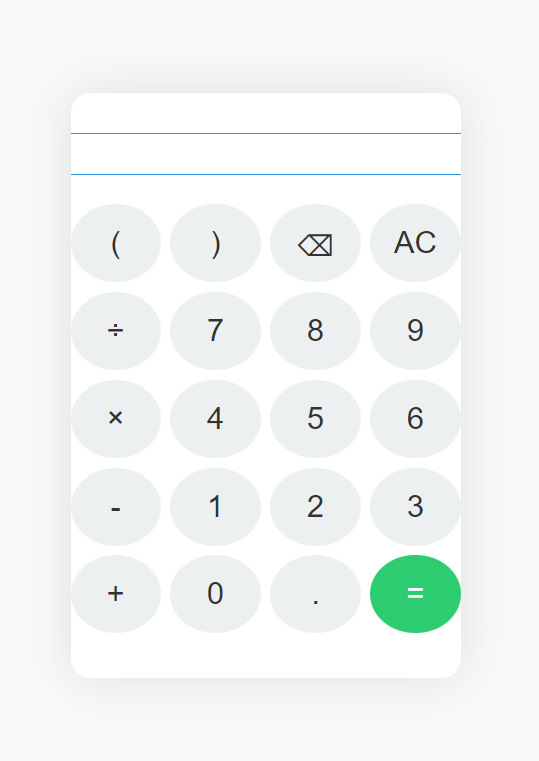

# 🧮 Calculator
## A website for the daily mathematical calculation.

# About Websites
### The inputs can be provided by the mouse as well keyboard.

# Algorithm Used
- Infix Expression Evaluator.
- Balanced paranthesis checker.
- And little bit js logics.

## License

This project is licensed under the [MIT License](LICENSE).
